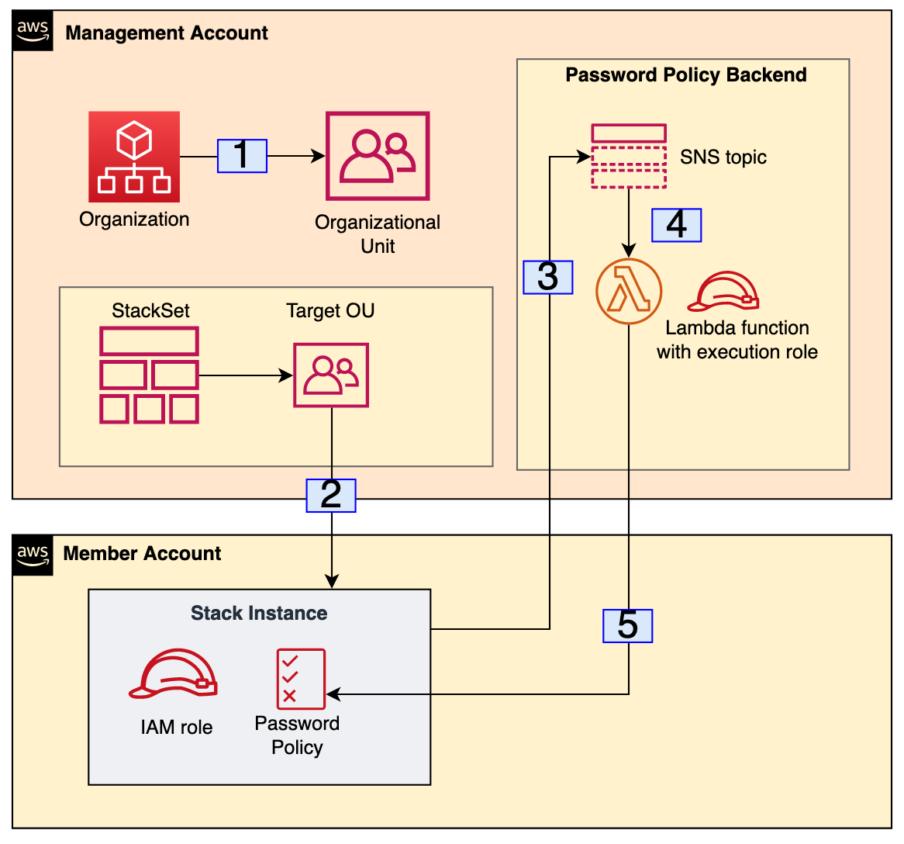
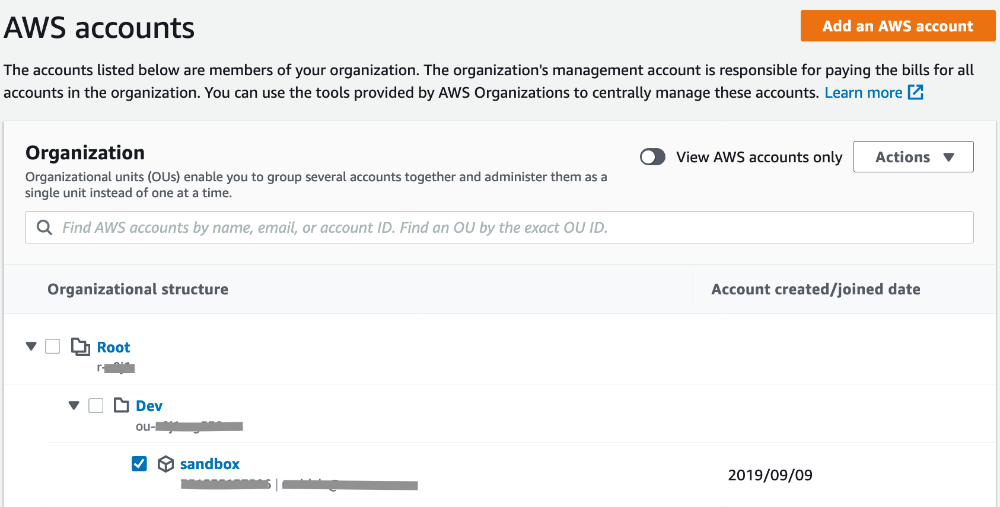
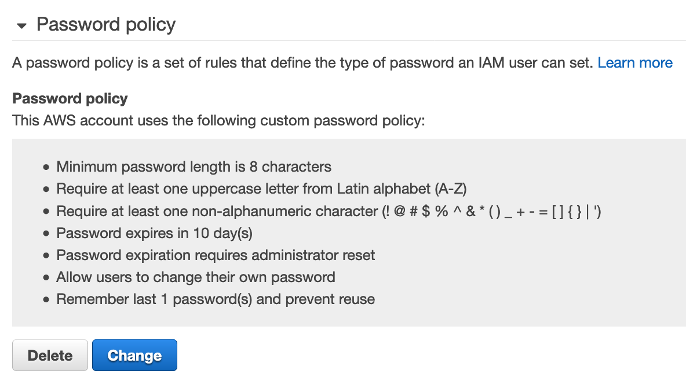
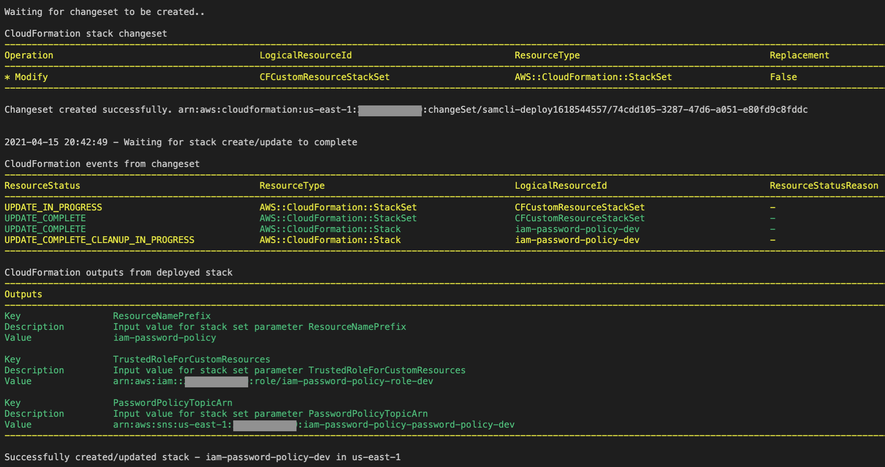

# IAM Password Policy Deployment via CloudFormation StackSets 
## Overview
In this sample code, I will show you how you can centrally manage the deployment of [IAM password policies](https://docs.aws.amazon.com/IAM/latest/UserGuide/id_credentials_passwords_account-policy.html) across a fleet of AWS accounts in your organization. You can accomplish this by using [AWS Organizations](https://aws.amazon.com/organizations/), [AWS CloudFormation StackSets](https://docs.aws.amazon.com/AWSCloudFormation/latest/UserGuide/what-is-cfnstacksets.html) and [CloudFormation custom resources](https://docs.aws.amazon.com/AWSCloudFormation/latest/UserGuide/template-custom-resources.html).


CloudFormation StackSets make it easy to deploy AWS resources, via a CloudFormation template, to multiple AWS accounts and regions. When you create a stack set, you can use [self-managed](https://docs.aws.amazon.com/AWSCloudFormation/latest/UserGuide/stacksets-getting-started-create.html#stacksets-getting-started-create-self-managed) or [service-managed](https://docs.aws.amazon.com/AWSCloudFormation/latest/UserGuide/stacksets-getting-started-create.html#stacksets-orgs-associate-stackset-with-org) permissions to orchestrate the deployment of your CloudFormation template. If you use self-managed permissions, you can deploy your CloudFormation template to specific AWS accounts and regions. If you go with service-managed permissions, you can target organizational units (OU's) or your entire AWS organization. This solution uses service-managed permissions with automated deployments, and it targets specific OU's in an AWS organization.

## Prerequisites
- **AWS SAM CLI** - You can follow the AWS [documentation](https://docs.aws.amazon.com/serverless-application-model/latest/developerguide/serverless-sam-cli-install.html) for the installation of this tool
- **S3 bucket** - An S3 bucket that SAM can use to orchestrate the deployment. You can use an existing bucket or create a new one
- **AWS access keys configured** - You can follow the AWS [documentation](https://docs.aws.amazon.com/cli/latest/userguide/cli-configure-quickstart.html) for detailed instructions. You need to have access keys for the management account. If you are deploying the solution from an EC2 instance, you can leverage an EC2 [instance profile](https://docs.aws.amazon.com/IAM/latest/UserGuide/id_roles_use_switch-role-ec2_instance-profiles.html) instead
- **AWS Organizations management account** - AWS account where the stack set will be deployed
- **Organizational unit (OU)** - AWS Organization's OU where you can place a member account
- **Member account in the organization** - AWS account to be placed in an OU 

## Limitations 

Currently this solution cannot be deployed in an AWS [Delegated Administrator](https://docs.aws.amazon.com/AWSCloudFormation/latest/UserGuide/stacksets-orgs-delegated-admin.html) account as presented. There is an open [issue](https://github.com/aws-cloudformation/aws-cloudformation-coverage-roadmap/issues/799) in the [AWS CloudFormation Coverage Roadmap](https://github.com/aws-cloudformation/aws-cloudformation-coverage-roadmap) GitHub repository. This issue is to add CloudFormation support for deploying stack sets with service-managed permissions in a Delegated Administrator account. If you must deploy this solution in a delegated account at this moment, you can remove the stack set resource from the template.yaml file and deploy that resource manually from the AWS Console. You must first deploy the template.yaml file via the SAM CLI commands that will be presented in the deployment section of the project. 


## Use cases
This solution can help you deploy a custom IAM password policy to accounts that are already members of an AWS Organizations OU. Once deployed, the solution will automatically deploy the specified password policy to new member accounts of the specified OU. 

## Workflow
Figure 1 shows the resources deployed in the involved AWS accounts. Since IAM password policies are currently not natively supported via CloudFormation, we will be using a custom resource with a single Lambda function deployed in the management account.  



*Figure 1*


1. In the AWS Organizations management account, an Administrator adds a new or an existing AWS account to a target OU.

2. Since this solution uses StackSets automated deployments, the stack set in the management account automatically responds to the event in step 1 by deploying a stack instance to the account that was just added to the target OU. If an account is removed from the target OU, the stack set automatically removes the stack instance from the account. 

  
  The stack instance deploys the CloudFormation template that was configured with the stack set. The template contains two AWS resources:

  An IAM role for cross account access. This is the first resource that gets created, and it is meant to be assumed by an AWS Lambda function in the management account. The permissions of this role are specific to managing an IAM password policy.

  ```yaml
    CFCustomResourceProviderRoleSpoke:
      Type: "AWS::IAM::Role"
      Properties:
        RoleName: !Sub ${ResourceNamePrefix}-role-${Environment}
        AssumeRolePolicyDocument:
          Version: 2012-10-17
          Statement:
            - Effect: Allow
              Principal:
                AWS: !Ref TrustedRoleForCustomResources
              Action: sts:AssumeRole
        Path: /
        Policies:
          - PolicyName: IAMPermissions
            PolicyDocument:
              Version: 2012-10-17
              Statement:
                  Effect: Allow
                  Action:
                    - iam:DeleteAccountPasswordPolicy
                    - iam:UpdateAccountPasswordPolicy
                  Resource: '*'
  ```


A password policy resource. This is a custom resource that uses a Lambda function in the management account as the backend service. In this resource, you can specify a password policy that comply with the security requirements of your organization. To review a description of the supported properties of the password policy, visit the documentation for the boto3 [update_account_password_policy](https://boto3.amazonaws.com/v1/documentation/api/latest/reference/services/iam.html#IAM.Client.update_account_password_policy) method.

  ```yaml
  PasswordPolicy:
    Type: Custom::PasswordPolicy
    DependsOn:
      - CFCustomResourceProviderRoleSpoke
    Properties:
      MinimumPasswordLength: 10
      RequireSymbols: true
      RequireNumbers: false
      RequireUppercaseCharacters: true
      RequireLowercaseCharacters: true
      AllowUsersToChangePassword: true
      MaxPasswordAge: 10
      PasswordReusePrevention: 1
      HardExpiry: true
      ServiceToken: !Ref PasswordPolicyTopicArn
  ```
       

3. The stack instance deployed to the target accounts request a password policy creation by publishing a message to the SNS topic in the management account.

4. The SNS topic invokes the Lambda function for the creation of the password policy. 

5. The Lambda function assumes the role created in the target accounts and performs the required actions to create the password policy. The Lambda function then informs CloudFormation that the custom resources were created successfully. 


## Deploying the solution

We will use the AWS SAM CLI to facilitate the build and deployment of the solution in the management account. We will be using standard commands to deploy and update our resources as needed. First lets explore some important directories and files that are part of the solution:

- *functions/password_policy/* directory. Contains the code for the Lambda function that creates an IAM password policy via a CloudFormation custom resources.
 
- *template.yaml*. This is the AWS SAM CLI template that deploys the solution. This template creates the following resources:
  - The Lambda function that creates the password policy custom resource
  - Lambda execution role that can assume another role in target accounts 
  - SNS topic that can trigger the Lambda function. A topic policy is created so that accounts from the organization can publish to the topic when creating custom resources. This is how other accounts can invoke the Lambda function in the management account.

In order to test, ensure that you have at least one AWS account as a member of an OU in the AWS Organizations console. We will be targeting the OU in our stack set deployment. Figure 2 shows an account named *sandbox* inside of an OU called Dev.

 

*Figure 2*

### Notes ###

  - The deployment of this solution happens in the AWS Organizations management account. Make sure you have configured your AWS CLI for this account.
  - Refer to the Limitations section of this project if you are interested in deploying this solution in a Delegated Account.

### Build

Build the SAM package with the command build command:

   ```code
   sam build
   ```

### Deployment

Replace the placeholder values and run the command below:

Syntax

  ```code
  sam deploy --stack-name <CloudFormation stack name> \
  --s3-bucket <S3 bucket name for the SAM CLI>  \
  --s3-prefix <bucket prefix for this deployment> \
  --region <AWS region for this deployment> \
  --capabilities <IAM capabilities> \
  --parameter-overrides  ParameterKey=<parameter key>,ParameterValue=<parameter value>
  ```

 ### Note ###

  - This solution requires the IAM capability ```CAPABILITY_NAMED_IAM```
  - The solution expects the following template parameters in the ```--parameter-overrides``` option:
    - ResourceNamePrefix
    - OrganizationID
    - TargetOU
    - Environment

Example

  ```code
  sam deploy --stack-name iam-password-policy-dev \
  --s3-bucket aws-sam-cli-managed-default-samclisourcebucket-1234567891 \
  --s3-prefix iam-password-policy \
  --region us-east-1 \
  --capabilities CAPABILITY_NAMED_IAM \
  --parameter-overrides  ParameterKey=ResourceNamePrefix,ParameterValue=iam-password-policy \
    ParameterKey=OrganizationID,ParameterValue=o-12dsf43dsafa \
    ParameterKey=TargetOU,ParameterValue=ou-td4h-1123dfgs \
    ParameterKey=Environment,ParameterValue=dev 
    
  ```
  
  Enter the parameter as follows:

  - **Stack name** The name of the CloudFormation stack that will be created by the SAM CLI 

  - **S3 bucket** The name of the S3 bucket that the SAM CLI can use for the deployment

  - **S3 prefix** A prefix in the S3 bucket where the SAM CLI can upload files for the deployment
    
  - **AWS region** The AWS region in which you will be deploying the SAM CLI templates

  - **Capabilities** IAM capabilities to be used by the SAM CLI
        
  - **ResourceNamePrefix** A string prefix that will be used to name resources created by CloudFormation

  - **OrganizationID** The AWS Organizations ID where the solution will be deployed. You can retrieve this value from the AWS Organizations console in the management account. 

  - **TargetOU** The OU that you will be targeting in the stack set

  - **Environment** An environment name that will be used to name the resources deployed
  
  ### Note ###

  You can optionally create a [AWS SAM CLI configuration file](https://docs.aws.amazon.com/serverless-application-model/latest/developerguide/serverless-sam-cli-config.html) to store default parameters for future use. This can be useful if you want to configure multiple environments with different OUs. 

  After a successful deployment, you can check an updated password policy in a member account of the OU you selected for the deployment. Figure 3 shows the password policy that was deployed.

  

  *Figure 3*

  If you want to update the password policy for all the member accounts of an OU, simply update the template, and run the build and deploy commands once again. The SAM CLI will monitor the progress of the update. The output from below corresponds to a password policy update. I updated the ```MinimumPasswordLength``` from ```10``` to ```12```. Figure 4 shows the outputs from the AWS CLI.

  

  *Figure 4*


  ## Summary

  In this sample code, I demonstrated how you can centrally manage the deployment of a an IAM password policy in your Organization. You use CloudFormation StackSets automated deployments to deploy your custom password policy as you provision new AWS accounts and place them in specific OU's. I also covered how you can easily update the password policy for an OU and monitor the progress using the AWS SAM CLI.

## Security

See [CONTRIBUTING](CONTRIBUTING.md#security-issue-notifications) for more information.

## License

This library is licensed under the MIT-0 License. See the LICENSE file.